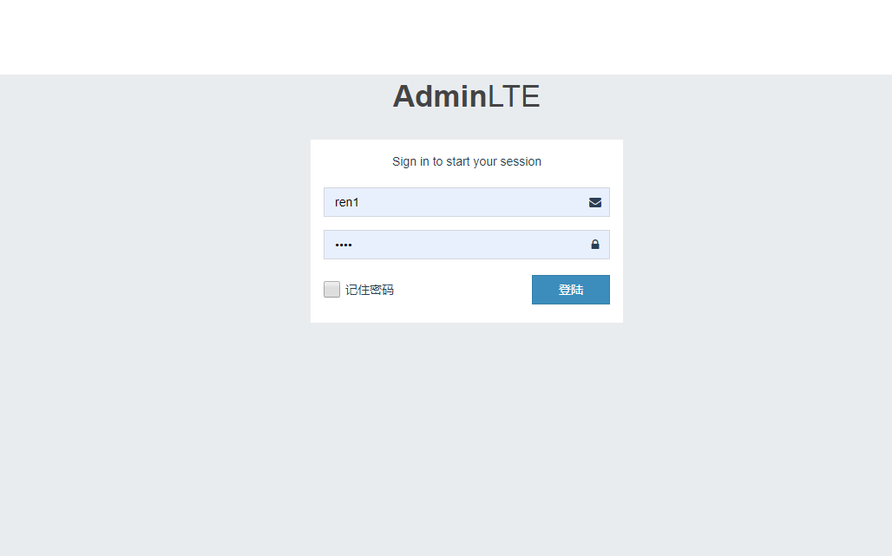
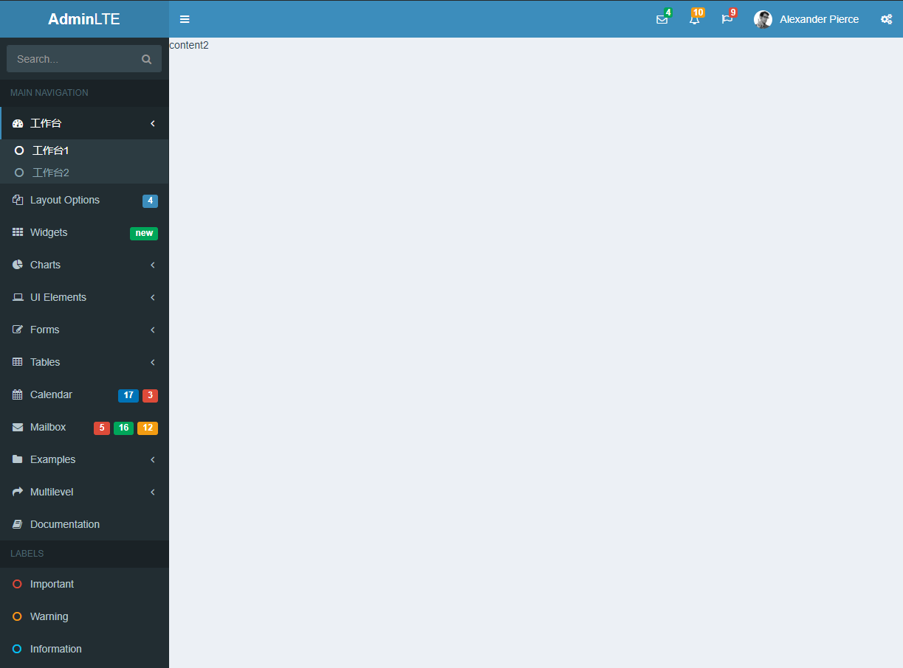

# Vue-AdminLTE

> A Vue.js project

## Build Setup

``` bash
# install dependencies
npm install

# serve with hot reload at localhost:8080 
npm run dev

```

## 目录结构

*  src
    *  assets         资源文件
    *  components
        *  common     公共组件
        *  content    内容文件夹
        *  example    示例
        *  home       首页
        *  login      登陆
    *  lib
    *  model
        *  Data.js    全局数据存储位置
    *  router
        *  router.js  路由


## 其他好看的UI
http://ace.jeka.by/index.html

http://www.h-ui.net/H-ui.admin.shtml

https://vue.ant.design/docs/vue/introduce-cn/    ant-design 蚂蚁金服出品，个人感觉很不错，配合vue-cli3使用


## 界面


